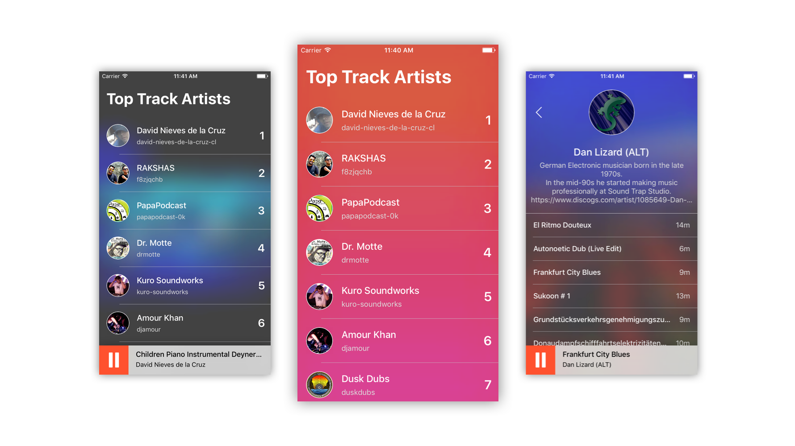

# Hearthis.at Player
**Minimalistic iOS player for Hearthis.at top track artists.**

    

## Features
- Pageable lists of Top Track Artists & Artist tracks.
- Support for background audio and remote events.
- Dynamic artwork backgrounds.

## About
**Xcode Version** 8.3.x  
**Deployment Target** iOS 10.0  
**Swift Version** 3.1

## Installation
- Clone the repo.
- Run `pod install` to install dependencies.
- Open and run the workspace.

## Dependencies
- [Alamofire](https://github.com/Alamofire/Alamofire) - The Alamofire Software Foundation.
- [AlamofireImage](https://github.com/Alamofire/AlamofireImage) - The Alamofire Software Foundation.
- [ObjectMapper](https://github.com/Hearst-DD/ObjectMapper) - Hearst Digital Innovation Group.
- [Listenable](https://github.com/msaps/Listenable) - Merrick Sapsford.
- [Jukebox](https://github.com/msaps/Jukebox) - Teodor Patraş / Merrick Sapsford.
- [SwiftHEXColors](https://github.com/thii/SwiftHEXColors) - Thi.
- [TinyConstraints](https://github.com/roberthein/TinyConstraints) - Robert-Hein Hooijmans.
